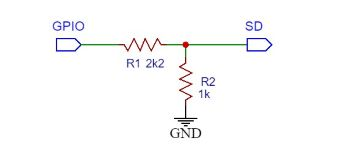
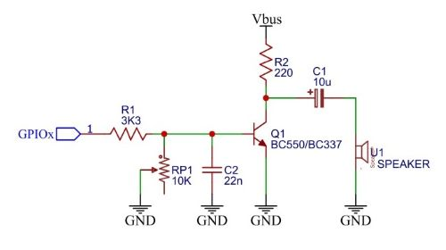

# Hardware Setup

## I2S Output (MAX98357A)

An I2S audio module is recommended for best audio quality and here is described the MAX98357A but you can use also other similar modules.

### Wiring

```
Raspberry Pi Pico          MAX98357A
─────────────────          ─────────
GP14 (I2S BCK)      →      BCK
GP15 (I2S WS/LRCLK) →      LRC
GP16 (I2S DATA)     →      DIN
3.3V                →      VIN
GND                 →      GND
                           SD → See below
```

### SD Pin (Shutdown/Mode)

The SD pin controls shutdown and mono/stereo mode:

- **GND** - Shutdown (muted)
- **~1.0V** - Mono output (left + right mixed)
- **3.3V** - Stereo output

**For mono (recommended):**
```




        3k3
3.3V ───┬─── GP14 ───┬─── SD (MAX98357A)
        │             │
        └─── 1k5 ─────┴─── GND
```
This gives ~1V on SD.

**For hardware mute control:**
```
GPIO ───┬─── 3k3 ───┬─── SD
        │           │
        └─── 1k5 ───┴─── GND
        
GPIO=HIGH → ~1V → Mono
GPIO=LOW  → 0V  → Mute
```

Use `AudioMuteHW()` / `AudioUnmuteHW()` functions.

### Configuration

In `picosound_user_cfg.h`:
```cpp
#define USER_SND_OUT    OUT_I2S
#define USER_PIN_BCK    14
#define USER_PIN_WS     15
#define USER_PIN_DATA   16
```

---

## PWM Output (Speaker/Amplifier)

While a simple prototype can be made using a resistor connected between the Pico's PWM pin and the "+" terminal of a small speaker with the "-" terminal connected to ground, a slightly better solution, both for sound quality and the integrity of the Pico itself, is to use a small NPN transistor. 

This not only manages the current consumption better without excessively overloading the Pico, but also preserves its integrity by isolating it from the inductive load.

### Wiring (NPN transistor + Passive Speaker)



**Note:** Low volume. Use amplifier for better results.

### Wiring (Class D Amplifier)

```
Pico GP17 → AMP IN
Pico GND  → AMP GND
AMP OUT   → Speaker
```

Popular amplifiers:
- PAM8403 (3W stereo)
- LM386 (1W mono)
- TDA2030 (18W mono)

### Configuration

In `picosound_user_cfg.h`:
```cpp
#define USER_SND_OUT    OUT_PWM
#define USER_PIN_SPKR   17
```

---

## Power Considerations

### I2S (MAX98357A)
- Current: ~10mA idle, ~500mA peak
- Use separate 5V supply for high volume
- Bypass capacitors: 100µF + 100nF near VIN

### PWM
- Current depends on amplifier
- Pico GPIO max: 12mA
- Always use amplifier for speakers >0.5W

---

## Troubleshooting

### No sound (I2S)
1. Check wiring (BCK, WS, DIN)
2. Verify SD pin voltage (~1V for mono)
3. Check `USER_SND_OUT == OUT_I2S` in config
4. Verify LittleFS mounted (for WAV files)

### No sound (PWM)
1. Check `USER_SND_OUT == OUT_PWM`
2. Verify speaker/amplifier connection
3. Increase volume with `SetMasterVolume(100)`

### Crackling/Distortion
1. Lower master volume
2. Check power supply (needs clean 5V)
3. Add decoupling capacitors
4. Reduce simultaneous channels

### Click during EEPROM write
Normal with I2S. Use hardware mute (see SD pin control above).
